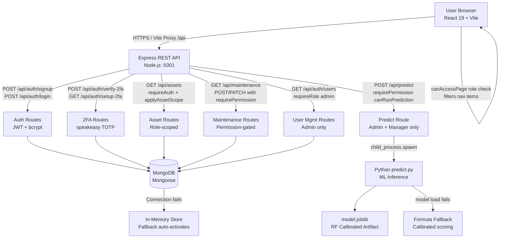

# Architecture

## GridPulse AI — Technical Architecture

---

## System Diagram



---

## Component Table

| Component | Technology | Responsibility |
|---|---|---|
| **React Frontend** | React 19, Vite 8.3 | SPA UI, role-gated routing, auth state management |
| **AuthContext** | React Context API | JWT token storage, login/signup/2FA flows, `can()` / `canAccessPage()` helpers |
| **Express API** | Node.js 18+, Express 4.21 | REST endpoints, middleware chain, Python process spawning |
| **Auth Middleware** | jsonwebtoken 9 | `requireAuth`, `requireRole`, `requirePermission`, `applyAssetScope` |
| **User Model** | Mongoose 8.9, bcryptjs 3 | User schema with hashed passwords, 2FA secrets, role, department |
| **2FA System** | speakeasy 2.0, qrcode 1.5 | TOTP secret generation, QR code creation, OTP verification |
| **MongoDB** | MongoDB 7+, Mongoose 8.9 | Persistent storage for users, assets, maintenance records |
| **In-Memory Fallback** | Plain JavaScript arrays | Zero-dependency fallback when MongoDB is unavailable |
| **ML Inference** | Python 3.8+, joblib | Loads `model.joblib`, applies feature engineering, returns `predict_proba` |
| **Random Forest Model** | scikit-learn, Platt calibration | 9-feature calibrated classifier, 97.73% CV accuracy |
| **Feature Engineering** | Python (train.py + predict.py) | Computes `thermal_load_idx`, `mech_health`, `moisture_age`, `overload_flag` |
| **Formula Fallback** | JavaScript (server.js) | Physics-calibrated scoring when Python is unavailable |

---

## Data Flow — End to End

### Authentication Flow

```
Browser                Express API              MongoDB
  │                        │                       │
  ├─POST /api/auth/login──►│                       │
  │   {email, password}    │                       │
  │                        ├─findOne({email})──────►│
  │                        │◄──────user document───│
  │                        │                       │
  │                        ├─bcrypt.compare()       │
  │                        │ (password hash check)  │
  │                        │                       │
  │  [If 2FA enabled]      │                       │
  │◄─{requiresTwoFactor:   │                       │
  │   true, preAuthToken}──│                       │
  │                        │                       │
  ├─POST /api/auth/         │                       │
  │  verify-2fa────────────►│                       │
  │   {preAuthToken, code} │                       │
  │                        ├─speakeasy.totp.verify()│
  │                        │ (TOTP window: ±2 steps)│
  │◄─{token, user}─────────│                       │
  │  (8-hour JWT)          │                       │
```

### ML Prediction Flow

```
React UI               Express API              Python Process
  │                        │                       │
  ├─POST /api/predict──────►│                       │
  │  {temp, load, vib,     │                       │
  │   hum, age}            │                       │
  │  Authorization: Bearer │                       │
  │                        ├─requireAuth()         │
  │                        ├─requirePermission(    │
  │                        │  'canRunPrediction')  │
  │                        │ [Employee → 403]      │
  │                        │                       │
  │                        ├─spawn('python',       │
  │                        │  ['predict.py',       │
  │                        │   JSON.stringify(…)]) │
  │                        │                       ├─joblib.load(model.joblib)
  │                        │                       ├─build_feature_vector()
  │                        │                       │  +thermal_load_idx
  │                        │                       │  +mech_health
  │                        │                       │  +moisture_age
  │                        │                       │  +overload_flag
  │                        │                       ├─model.predict_proba()
  │                        │                       ├─get_diagnostics()
  │                        │◄─JSON stdout──────────│
  │◄─{failureProbability,  │                       │
  │   riskCategory,        │                       │
  │   recommendation,      │                       │
  │   reasons}─────────────│                       │
```

### RBAC Asset Scoping Flow

```
Employee Login                API Call                MongoDB Query
  │                              │                        │
  ├─JWT contains {role:'employee'}│                        │
  │                              │                        │
  ├─GET /api/assets──────────────►│                        │
  │  Authorization: Bearer …     │                        │
  │                              ├─requireAuth()          │
  │                              ├─applyAssetScope()      │
  │                              │  role='employee'       │
  │                              │  → filter = {_id: {   │
  │                              │    $in: assignedAssets}}│
  │                              │                        │
  │                              ├─Asset.find(filter)─────►│
  │◄─[only assigned assets]──────│◄──filtered results─────│
```

---

## Security Notes

| Concern | Implementation |
|---|---|
| Password storage | bcrypt, cost factor 12 (~250ms hash time — resistant to brute force) |
| Session tokens | HS256 JWT, 8-hour expiry, secret configurable via `JWT_SECRET` env var |
| 2FA pre-auth tokens | Short-lived (5 minutes), single-use pattern, `step: 'pre-2fa'` claim |
| TOTP window | `window: 2` (±2 × 30-second steps = ±60 seconds clock skew tolerance) |
| Role enforcement | Both API middleware AND React UI — defense in depth |
| Asset scoping | Employees see only `assignedAssets` array from their user document — enforced in MongoDB query |
| Sensitive fields | `twoFactorSecret` and `twoFactorTempSecret` stripped from all JSON responses via Mongoose transform |
| .env | `.env` is in `.gitignore` — real secrets never committed |

---

## Scalability Notes

The current architecture is a monolith suitable for a hackathon / college project. For production at scale:

- **Horizontally scale Express** behind a load balancer; use Redis for shared session state
- **Replace in-memory fallback** with MongoDB Atlas with replica sets
- **Add MQTT/Kafka broker** for real-time SCADA sensor ingestion
- **Move ML inference** to a dedicated Python microservice (FastAPI) to avoid `child_process.spawn` overhead
- **Add HTTPS** via nginx reverse proxy with Let's Encrypt
- **Implement refresh token rotation** for longer-lived sessions without security compromise
