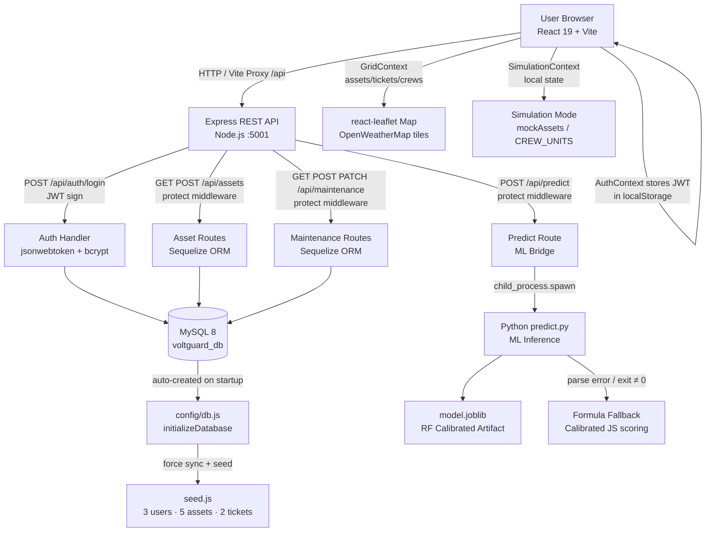

# Architecture

## GridSentinel AI — Technical Architecture

---

## System Diagram



---

## Component Table

| Component | Technology | Responsibility |
|---|---|---|
| **React Frontend** | React 19, Vite 8.3 | SPA UI, role-gated routing, auth state management |
| **AuthContext** | React Context API | JWT token storage, login flow, `user.role` guard helpers |
| **GridContext** | React Context API | Centralised asset/ticket/crew state, localStorage persistence, derived AI metrics |
| **SimulationContext** | React Context API | Simulation-mode provider reading from `mockAssets.js` and `CREW_UNITS` |
| **react-leaflet Map** | react-leaflet 5, Leaflet 1.9 | Geospatial digital-twin map, OpenWeatherMap tile overlays, node telemetry drawer |
| **Express API** | Node.js 18+, Express 4.21 | REST endpoints, JWT `protect` middleware, Python process spawning |
| **JWT Middleware** | jsonwebtoken 9 | `protect` — Bearer token extraction, verify, `req.user` injection |
| **User Model** | Sequelize 6, bcrypt 6 | UUID PK, email unique, role enum, `beforeCreate`/`beforeUpdate` hash hooks, `matchPassword()` |
| **Asset Model** | Sequelize 6 | UUID PK, sensor fields (temperature, load, vibration, humidity, age), riskScore, status |
| **Maintenance Model** | Sequelize 6 | UUID PK, assetId FK, problem, priority, recommendation, technician, status |
| **config/db.js** | Sequelize + mysql2 | Auto-creates `voltguard_db` if missing, exports `sequelize` instance |
| **seed.js** | Node.js | Idempotent DB init — syncs schemas (force), seeds 3 users + 5 assets + 2 maintenance records |
| **ML Inference** | Python 3.8+, joblib | Loads `model.joblib`, applies feature engineering, returns `predict_proba` as JSON stdout |
| **Random Forest Model** | scikit-learn, Platt calibration | 5-feature calibrated classifier, 97.73% CV accuracy, ROC-AUC 0.9962 |
| **Formula Fallback** | JavaScript (server.js) | Physics-calibrated scoring when Python is unavailable — identical risk thresholds |
| **exportCsv.js** | Browser JS | UTF-8 BOM CSV generation for the asset registry — Excel/Python/GIS compatible |

---

## Data Flow — End to End

### Authentication Flow

```
Browser                Express API              MySQL (voltguard_db)
  │                        │                           │
  ├─POST /api/auth/login──►│                           │
  │  {email, password}     │                           │
  │                        ├─User.findOne({email})─────►│
  │                        │◄──── user row ────────────│
  │                        │                           │
  │                        ├─user.matchPassword()      │
  │                        │  bcrypt.compare()         │
  │                        │                           │
  │◄─{token, user}─────────│                           │
  │  (JWT — 1-day expiry)  │                           │
  │                        │                           │
  │  [subsequent requests] │                           │
  ├─GET /api/assets────────►│                           │
  │  Authorization: Bearer │                           │
  │                        ├─protect()                 │
  │                        │  jwt.verify(token)        │
  │                        │  → req.user = {id, role}  │
  │                        ├─Asset.findAll()────────────►│
  │◄─[assets array]────────│◄────── rows ──────────────│
```

### ML Prediction Flow

```
React UI               Express API              Python Process
  │                        │                           │
  ├─POST /api/predict──────►│                           │
  │  {temp, load, vib,     │                           │
  │   hum, age}            │                           │
  │  Authorization: Bearer │                           │
  │                        ├─protect()                 │
  │                        │  jwt.verify() → req.user  │
  │                        │                           │
  │                        ├─spawn(pythonBin,          │
  │                        │  ['predict.py', payload]) │
  │                        │                           ├─joblib.load(model.joblib)
  │                        │                           ├─build_feature_vector()
  │                        │                           │  thermal_load_idx
  │                        │                           │  mech_health
  │                        │                           │  moisture_age
  │                        │                           │  overload_flag
  │                        │                           ├─model.predict_proba()
  │                        │◄─JSON stdout──────────────│
  │◄─{failureProbability,  │                           │
  │   riskCategory,        │  [if Python fails]        │
  │   possibleFailure,     ├─formula fallback scorer   │
  │   recommendation}──────│                           │
```

### Database Startup & Seeding Flow

```
npm run dev (backend)
  │
  ├─ server.js: await seedDatabase()
  │
  ├─ seed.js → initializeDatabase()
  │    └─ mysql2 CREATE DATABASE IF NOT EXISTS voltguard_db
  │
  ├─ sequelize.sync({ force: true })
  │    └─ DROP + CREATE: Users, Assets, Maintenances
  │
  ├─ User.create(×3)   → admin / technician / viewer
  ├─ Asset.create(×5)  → transformer + feeder fleet
  └─ Maintenance.create(×2) → Critical + High tickets
```

---

## Security Notes

| Concern | Implementation |
|---|---|
| Password storage | bcrypt, salt rounds 10 (~100ms hash time) via Sequelize `beforeCreate` / `beforeUpdate` hooks |
| Session tokens | HS256 JWT, 24-hour expiry; secret configurable via `JWT_SECRET` env var (default hardcoded for dev) |
| Protected routes | `protect` middleware — all `/api/assets`, `/api/maintenance`, `/api/predict` endpoints require valid Bearer token |
| Role enforcement | React UI nav guards + backend JWT role claim — defense in depth |
| Credentials | DB credentials in `backend/config/db.js` — should be moved to env vars for production |
| `.env` | `.env` in `.gitignore` — no real secrets committed |

---

## Scalability Notes

The current architecture is a monolith suitable for a hackathon / college project. For production at scale:

- **Horizontally scale Express** behind a load balancer; use Redis for shared JWT session cache
- **Move DB credentials** to environment variables / secrets manager (AWS SSM, HashiCorp Vault)
- **Replace `force: true` sync** with proper Sequelize migrations for zero-downtime schema changes
- **Add MQTT/Kafka broker** for real-time SCADA sensor ingestion (replacing physics-simulated data)
- **Move ML inference** to a dedicated Python microservice (FastAPI) to avoid `child_process.spawn` overhead
- **Add HTTPS** via nginx reverse proxy with Let's Encrypt
- **Implement refresh token rotation** for longer-lived sessions without security compromise
